<div align="center">

  <p>
    <strong>🎨 Portfolio With Admin Panel</strong>
  </p>

  <h1>Portfolio With Admin Panel</h1>

  <p><em>A full-stack MERN portfolio with a CMS-style admin panel — JWT cookie auth, Cloudinary image uploads, a contact form with email notifications, dynamic site settings, and a security-hardened Express API.</em></p>

  <p>
    
    
    
    
    
    
    
    
    
  </p>

  <p>
    <a href="https://portfolio-with-admin-panel.netlify.app/">Live Demo</a> •
    <a href="#features">Features</a> •
    <a href="#installation">Quick Start</a> •
    <a href="#api-endpoints">API Docs</a> •
    <a href="#screenshots">Screenshots</a>
  </p>

</div>

---

## Features

- **Responsive Single-Page Portfolio** — Fully responsive design with smooth scroll animations and a glassmorphism dark theme
- **Admin Panel (CMS)** — JWT-authenticated admin dashboard for managing all portfolio content without touching code
- **Project Management** — Full CRUD operations with Cloudinary image uploads, featured project highlighting, and draft/published status
- **Skill Management** — Create, edit, and delete skills with category grouping and proficiency levels (0–100)
- **Contact Form** — Visitors can send messages directly; the admin receives email notifications via Nodemailer (SMTP)
- **Message Inbox** — Admin inbox to view, read, and manage contact form submissions with read/unread status
- **Site Settings** — Dynamic site configuration (name, role, bio, social links) editable from the admin panel; changes reflect on the public portfolio via `SettingsContext`
- **Unread Message Badge** — Admin sidebar shows a live unread message count; the dashboard displays message statistics
- **SEO Optimized** — Dynamic meta tags with `react-helmet-async` and Open Graph support
- **Scroll Progress Bar** — Visual scroll indicator, animated counters, and micro-interactions throughout the UI
- **Route Protection** — Admin routes are guarded; unauthenticated users are redirected to login
- **Security Hardened** — Helmet, CORS whitelist, rate limiting, input sanitization, HPP-style protection, and bcrypt password hashing
- **Swagger API Docs** — Interactive OpenAPI 3.0 documentation at `/api-docs` with full schema definitions and try-it-out

---

## Live Demo

[🚀 View Live Demo](https://portfolio-with-admin-panel.netlify.app/)

---

## Screenshots

Captured from the [live deployment](https://portfolio-with-admin-panel.netlify.app/). The first row is the public portfolio; the remaining rows are the JWT-secured admin panel.

<table>
  <tr>
    <td align="center" width="33%">
      <a href="./assets/screenshots/hero.png">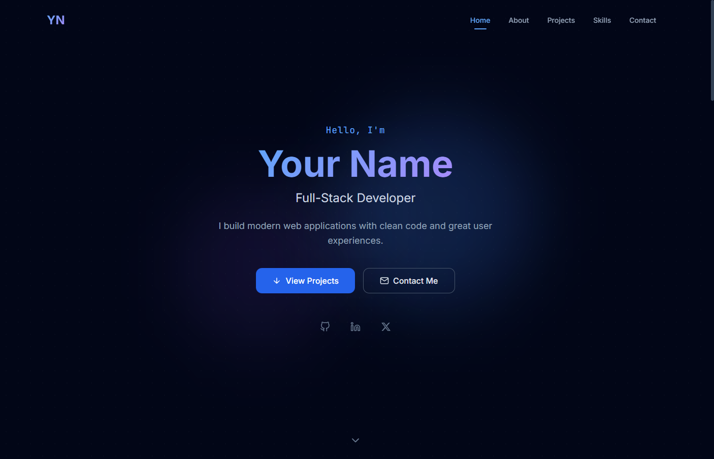</a>
      <sub><b>Hero</b><br/>Landing with greeting, role & CTAs</sub>
    </td>
    <td align="center" width="33%">
      <a href="./assets/screenshots/about.png">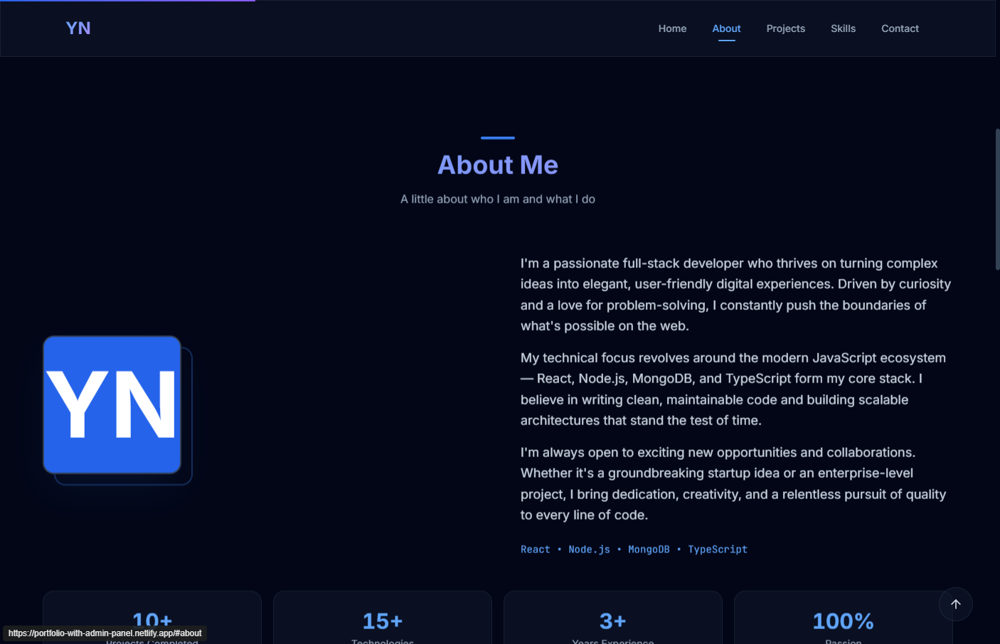</a>
      <sub><b>About</b><br/>Bio paragraphs & animated stats</sub>
    </td>
    <td align="center" width="33%">
      <a href="./assets/screenshots/contact.png">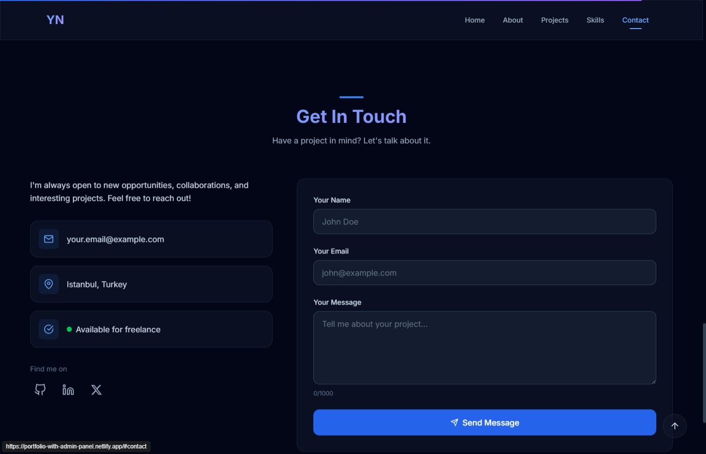</a>
      <sub><b>Contact</b><br/>Validated form & social links</sub>
    </td>
  </tr>
  <tr>
    <td align="center" width="33%">
      <a href="./assets/screenshots/admin-login.png">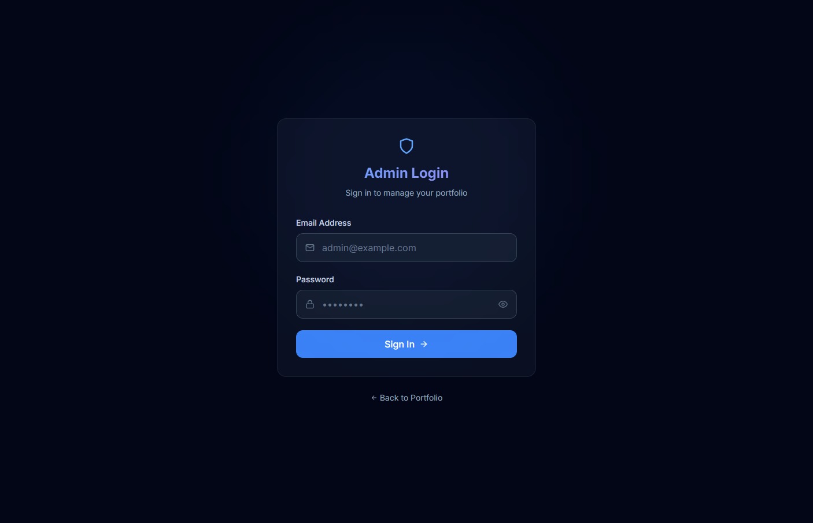</a>
      <sub><b>Admin login</b><br/>Secure entry to the panel</sub>
    </td>
    <td align="center" width="33%">
      <a href="./assets/screenshots/admin-dashboard.png">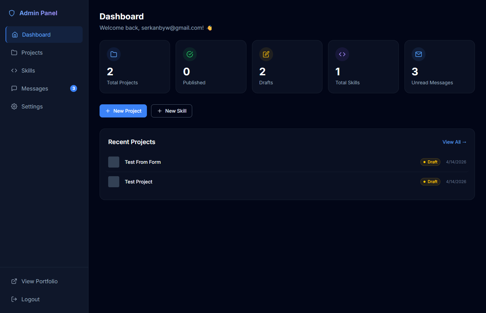</a>
      <sub><b>Dashboard</b><br/>Project, skill & message stats</sub>
    </td>
    <td align="center" width="33%">
      <a href="./assets/screenshots/admin-projects.png">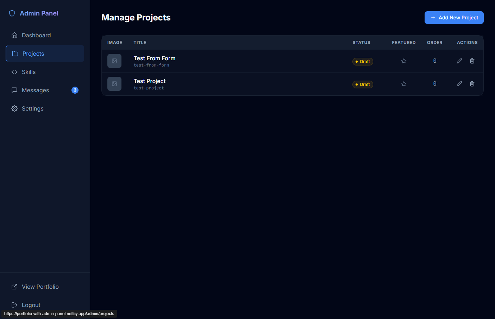</a>
      <sub><b>Projects</b><br/>CRUD table with status & order</sub>
    </td>
  </tr>
  <tr>
    <td align="center" width="33%">
      <a href="./assets/screenshots/admin-skills.png">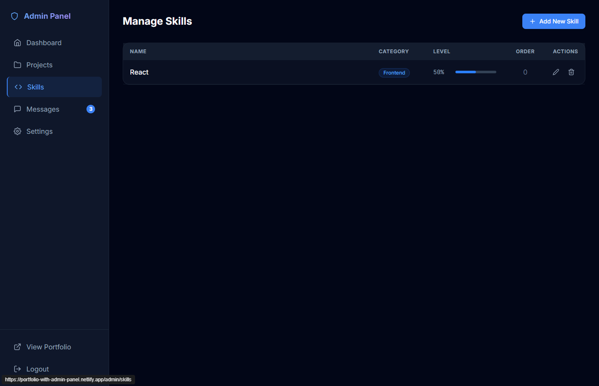</a>
      <sub><b>Skills</b><br/>Categorized proficiency levels</sub>
    </td>
    <td align="center" width="33%">
      <a href="./assets/screenshots/admin-messages.png">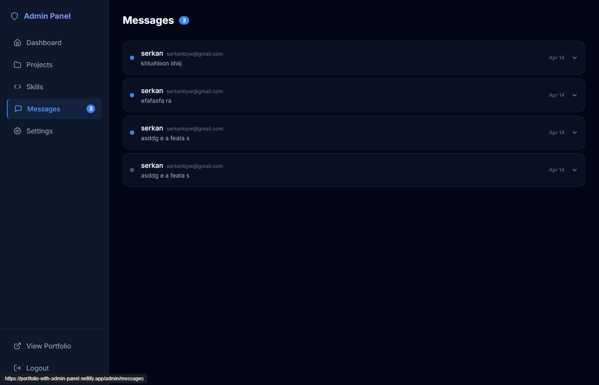</a>
      <sub><b>Messages</b><br/>Inbox with read/unread state</sub>
    </td>
    <td align="center" width="33%">
      <a href="./assets/screenshots/admin-settings.png">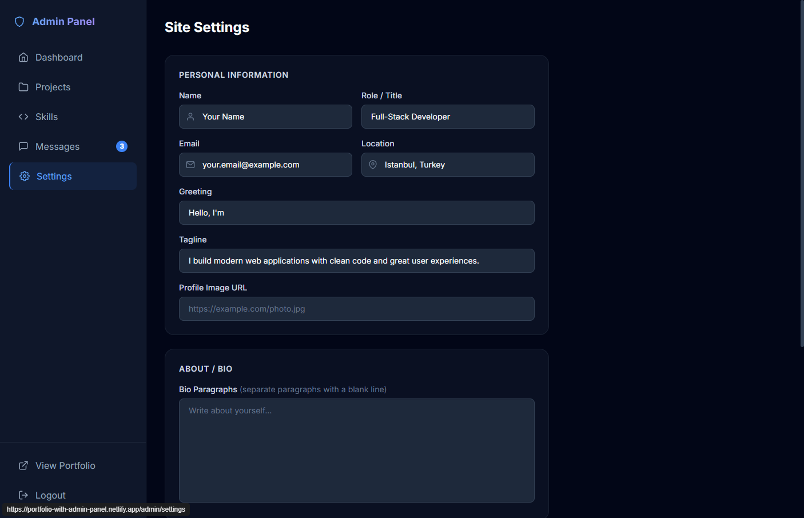</a>
      <sub><b>Settings</b><br/>Dynamic site configuration</sub>
    </td>
  </tr>
</table>

---

## Architecture

A high-level visual map of the system. Both diagrams render natively on GitHub thanks to Mermaid support.

### Domain Model

How the core collections relate to each other across the public site and the admin panel.

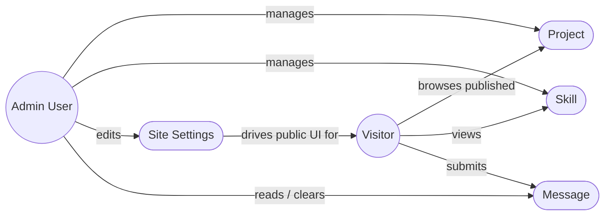

### Request Lifecycle

How a single browser action travels through the stack.

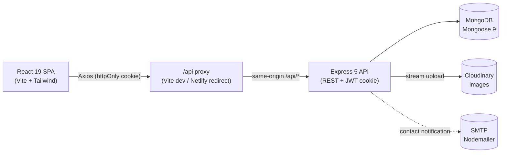

---

## Technologies

### Frontend

- **React 19** — Modern UI library with hooks and context for state management
- **Vite 8** — Lightning-fast build tool and dev server with HMR
- **Tailwind CSS 4** — Utility-first CSS framework with the `@tailwindcss/vite` plugin
- **Framer Motion 12** — Production-ready animation library for smooth transitions and scroll effects
- **React Router 7** — Declarative client-side routing with nested layouts
- **Axios** — Promise-based HTTP client with interceptors for retries and error handling
- **React Helmet Async** — SEO management with dynamic meta tags and Open Graph support
- **React Hot Toast** — Elegant toast notifications for user feedback
- **React Icons** — Icon library for consistent visual elements

### Backend

- **Node.js** — Server-side JavaScript runtime
- **Express 5** — Minimal and flexible web application framework
- **MongoDB (Mongoose 9)** — NoSQL database with elegant object modeling and schema validation
- **JWT (jsonwebtoken)** — Stateless authentication delivered via secure `httpOnly` cookies
- **Cloudinary** — Cloud-based image upload, storage, and transformation
- **Nodemailer** — Email sending for contact form notifications via SMTP
- **Multer 2** — Multipart form-data handling for image uploads (memory storage)
- **bcryptjs** — Secure password hashing with configurable salt rounds
- **express-validator** — Request validation and sanitization middleware
- **Helmet** — Secure HTTP headers
- **express-rate-limit** — Rate limiting for API protection
- **express-mongo-sanitize** — NoSQL injection prevention
- **swagger-jsdoc / swagger-ui-express** — Interactive OpenAPI 3.0 documentation

---

## Installation

### Prerequisites

- **Node.js** v18+ and **npm**
- **MongoDB** — [MongoDB Atlas](https://www.mongodb.com/atlas) (free tier) or a local instance
- **[Cloudinary](https://cloudinary.com)** account (free tier) for image uploads
- **SMTP email account** — Gmail with an App Password or any SMTP provider

### Local Development

**1. Clone the repository:**

```bash
git clone https://github.com/serkanbyx/portfolio-with-admin-panel.git
cd portfolio-with-admin-panel
```

**2. Set up environment variables:**

```bash
cp server/.env.example server/.env
```

> The client needs **no environment variables**. It talks to the backend through a same-origin `/api` proxy — handled by the Vite dev server proxy locally (`vite.config.js`) and by a Netlify redirect in production (`netlify.toml`).

**server/.env**

```env
NODE_ENV=development
PORT=5000
MONGO_URI=mongodb://localhost:27017/portfolio
JWT_SECRET=your_jwt_secret_min_32_chars_here_change_this
JWT_EXPIRES_IN=7d
CLIENT_URL=http://localhost:5173
CLOUDINARY_CLOUD_NAME=your_cloud_name
CLOUDINARY_API_KEY=your_api_key
CLOUDINARY_API_SECRET=your_api_secret
ADMIN_EMAIL=admin@example.com
ADMIN_PASSWORD=your_secure_password
SMTP_HOST=smtp.gmail.com
SMTP_PORT=587
SMTP_USER=your_email@gmail.com
SMTP_PASS=your_app_password
CONTACT_TO_EMAIL=your_email@gmail.com
```

**3. Install dependencies:**

```bash
cd server && npm install
cd ../client && npm install
```

**4. Seed the admin user:**

```bash
cd ../server && npm run seed
```

**5. Run the application:**

```bash
# Terminal 1 — Backend
cd server && npm run dev

# Terminal 2 — Frontend
cd client && npm run dev
```

The frontend runs at `http://localhost:5173` and the backend at `http://localhost:5000`.

---

## Usage

1. **Visit the portfolio** — Open `http://localhost:5173` to see the public-facing portfolio
2. **Navigate to admin** — Go to `/admin/login` and sign in with the `ADMIN_EMAIL` and `ADMIN_PASSWORD` from your `.env`
3. **Manage projects** — Add, edit, and delete projects; upload images via Cloudinary; toggle featured/draft status
4. **Manage skills** — Create skills with categories (frontend, backend, database, devops, tools) and proficiency levels
5. **View dashboard** — See a stats overview for total projects, skills, and unread messages
6. **Contact form** — Visitors send messages from the public portfolio; you receive them via email
7. **Message inbox** — View and manage contact form submissions; messages are marked as read automatically
8. **Site settings** — Update your name, role, bio, profile image URL, and social links from the settings page
9. **Logout** — Click logout from the admin panel to end the session

---

## How It Works?

### Authentication Flow

The application uses a single-admin JWT authentication model. The admin user is created via a seed script (`npm run seed`) that reads credentials from environment variables. On login, the server validates credentials with bcrypt, generates a JWT, and sends it to the client in a **secure, `httpOnly` cookie** — never exposed to JavaScript, which protects against XSS token theft. The browser automatically attaches the cookie to every subsequent same-origin API request (`withCredentials: true`), so no manual token handling is needed on the client.

```javascript
// Server — issues the JWT as an httpOnly cookie on login
res.cookie("token", token, {
  httpOnly: true,
  secure: process.env.NODE_ENV === "production",
  sameSite: process.env.NODE_ENV === "production" ? "none" : "lax",
  maxAge: cookieMaxAge,
});
```

The backend also accepts an `Authorization: Bearer <token>` header as a fallback, but the cookie flow is the primary mechanism. On `401`, the Axios response interceptor redirects the user from any protected `/admin/*` route to the login page.

### Route Protection

On the frontend, `AdminRoute` and `GuestOnlyRoute` guards wrap protected routes. `AdminRoute` checks `AuthContext` for an authenticated admin user before rendering child routes; otherwise it redirects to `/admin/login`. On the backend, the `protect` middleware verifies the JWT and the `adminOnly` middleware checks the user role.

### Data Flow

1. **Public visitors** → React fetches published projects, skills, and site settings from public API endpoints (no auth required) → `SettingsContext` merges API data over `siteConfig` defaults (only non-empty admin values override)
2. **Admin** → Authenticated requests hit protected endpoints → Express validates input with `express-validator` → Controllers interact with Mongoose models → Response sent back to the client
3. **Image uploads** → Multer processes the file in memory → Controller uploads to Cloudinary → URL and public ID stored in MongoDB
4. **Contact form** → Validated message data → Stored in the Messages collection → Nodemailer sends an email via SMTP → Toast confirmation shown to the visitor
5. **Settings sync** → Admin edits site settings → Saved to MongoDB → Public portfolio reads updated settings via `SettingsContext`

---

## API Endpoints

| Method   | Endpoint                  | Auth      | Description               |
| -------- | ------------------------- | --------- | ------------------------- |
| `POST`   | `/api/auth/login`         | No        | Admin login (sets cookie) |
| `POST`   | `/api/auth/logout`        | JWT       | Admin logout (clears cookie) |
| `GET`    | `/api/auth/me`            | JWT       | Get current user          |
| `GET`    | `/api/projects`           | No        | Get published projects    |
| `GET`    | `/api/projects/admin/all` | JWT+Admin | Get all projects (admin)  |
| `GET`    | `/api/projects/:slug`     | No        | Get project by slug       |
| `POST`   | `/api/projects`           | JWT+Admin | Create project            |
| `PUT`    | `/api/projects/:id`       | JWT+Admin | Update project            |
| `DELETE` | `/api/projects/:id`       | JWT+Admin | Delete project            |
| `POST`   | `/api/projects/:id/image` | JWT+Admin | Upload project image      |
| `DELETE` | `/api/projects/:id/image` | JWT+Admin | Delete project image      |
| `GET`    | `/api/skills`             | No        | Get all skills            |
| `POST`   | `/api/skills`             | JWT+Admin | Create skill              |
| `PUT`    | `/api/skills/:id`         | JWT+Admin | Update skill              |
| `DELETE` | `/api/skills/:id`         | JWT+Admin | Delete skill              |
| `POST`   | `/api/contact`            | No        | Send contact message      |
| `GET`    | `/api/messages`           | JWT+Admin | Get all messages          |
| `PATCH`  | `/api/messages/:id/read`  | JWT+Admin | Mark message as read      |
| `DELETE` | `/api/messages/:id`       | JWT+Admin | Delete message            |
| `GET`    | `/api/settings`           | No        | Get site settings         |
| `PUT`    | `/api/settings`           | JWT+Admin | Update site settings      |
| `GET`    | `/api/health`             | No        | Health check              |
| `GET`    | `/api-docs`               | No        | Swagger API documentation |

> Protected endpoints rely on the `httpOnly` auth cookie set on login, with `Authorization: Bearer <token>` accepted as a fallback.

---

## Project Structure

A clean monorepo layout with an explicit backend / frontend split. Each panel below is collapsible — expand the one you care about.

<details open>
<summary><b>Server</b> — Express 5 API</summary>

```
server/
├── config/          # env validation, db connection, swagger spec
├── controllers/     # auth, project, skill, contact, message, settings
├── middlewares/     # auth (protect/adminOnly), rateLimiter, upload, validate, errorHandler
├── models/          # Mongoose schemas: User, Project, Skill, Message, Settings
├── routes/          # one file per resource group
├── utils/           # cloudinary, sendEmail, helpers (token, cookie, escapeHtml)
├── validators/      # express-validator schemas per resource
├── index.js         # Express app composition + welcome page
├── seed.js          # admin user seeder
└── .env.example
```

</details>

<details>
<summary><b>Client</b> — React 19 + Vite SPA</summary>

```
client/
├── public/          # robots.txt, sitemap.xml
├── src/
│   ├── api/         # Axios instance with retry + 401 redirect interceptor
│   ├── components/  # admin/, layout/, sections/, ui/ (reusable)
│   ├── contexts/    # AuthContext, SettingsContext
│   ├── guards/      # AdminRoute, GuestOnlyRoute
│   ├── hooks/       # useDebounce, useMediaQuery, useScrollSpy
│   ├── config/      # siteConfig (public defaults)
│   ├── pages/       # public + admin pages
│   ├── services/    # API call wrappers per resource
│   ├── utils/       # animations, constants
│   ├── App.jsx      # router + layouts
│   └── main.jsx     # entry point + providers
├── netlify.toml     # /api proxy + SPA fallback
└── vite.config.js
```

</details>

<details>
<summary><b>Repository root</b> — docs & governance</summary>

```
portfolio-with-admin-panel/
├── client/          # → see Client panel above
├── server/          # → see Server panel above
├── .github/         # issue templates, PR template, CODE_OF_CONDUCT, CONTRIBUTING, SECURITY
├── LICENSE
└── README.md
```

</details>

---

## Security

- **Helmet** — Sets secure HTTP headers (with a CSP relaxed only for Swagger UI and the welcome page)
- **httpOnly Cookies** — JWT is stored in a secure, `httpOnly`, `sameSite` cookie, never readable by JavaScript
- **CORS** — Strict origin whitelist with credentials; only the configured `CLIENT_URL` is allowed
- **Rate Limiting** — Multiple tiers: global (100/15min), auth (10/15min), contact (5/hour in prod), upload (20/15min)
- **express-mongo-sanitize** — Strips `$` and `.` from user input to prevent NoSQL injection attacks
- **bcryptjs** — Password hashing; passwords are never stored in plain text
- **Input Validation** — All write endpoints validated with express-validator; structured error responses
- **HTML Escaping** — Contact form fields are escaped before being embedded in notification emails
- **File Upload Restrictions** — Multer enforces image-only uploads, a max file size, and memory storage
- **Request Size Limits** — JSON and URL-encoded body parsing limited to 10KB
- **Env Validation** — The server refuses to boot if required env vars are missing, or if production secrets are too weak

---

## Deployment

### Backend — Render

1. Create a new **Web Service** on [Render](https://render.com) and connect your GitHub repository.
2. Configure the service:
   - **Root Directory:** `server`
   - **Build Command:** `npm install`
   - **Start Command:** `npm start`
   - **Environment:** `Node`
3. Add environment variables:

| Variable                | Value                                       |
| ----------------------- | ------------------------------------------- |
| `NODE_ENV`              | `production`                                |
| `MONGO_URI`             | MongoDB Atlas connection string             |
| `JWT_SECRET`            | Random 64-char hex (`openssl rand -hex 32`) |
| `JWT_EXPIRES_IN`        | `7d`                                        |
| `CLIENT_URL`            | Netlify frontend URL (no trailing slash)    |
| `CLOUDINARY_CLOUD_NAME` | Cloudinary dashboard → Cloud name           |
| `CLOUDINARY_API_KEY`    | Cloudinary dashboard → API Key              |
| `CLOUDINARY_API_SECRET` | Cloudinary dashboard → API Secret           |
| `ADMIN_EMAIL`           | Admin email address                         |
| `ADMIN_PASSWORD`        | Strong password (min 8 chars)               |
| `SMTP_HOST`             | `smtp.gmail.com`                            |
| `SMTP_PORT`             | `587`                                       |
| `SMTP_USER`             | Your Gmail address                          |
| `SMTP_PASS`             | Gmail App Password                          |
| `CONTACT_TO_EMAIL`      | Contact form recipient email                |

4. Deploy and verify: `GET https://your-app.onrender.com/api/health`
5. Run `npm run seed` via the Render Shell tab to create the admin user.

### Frontend — Netlify

1. Create a new site on [Netlify](https://www.netlify.com) and connect your GitHub repository.
2. Configure the build:
   - **Base Directory:** `client`
   - **Build Command:** `npm run build`
   - **Publish Directory:** `dist` (relative to the base directory)
3. Point the API proxy at your backend. The client requires **no environment variables** — instead, update the `/api/*` redirect target in `client/netlify.toml` to your Render backend URL:

```toml
[[redirects]]
  from = "/api/*"
  to = "https://your-app.onrender.com/api/:splat"
  status = 200
  force = true
```

4. Deploy.

> **Note:** Both the API proxy and SPA client-side routing are handled by `client/netlify.toml`. The `/api/*` redirect proxies API calls to the backend (keeping requests same-origin so the auth cookie works), and the `/*` fallback redirects all other routes to `index.html`.

### MongoDB Atlas Setup

1. Create a free cluster on [MongoDB Atlas](https://www.mongodb.com/atlas).
2. Create a database user with a **strong generated password** (different from `ADMIN_PASSWORD`).
3. Network Access: add `0.0.0.0/0` to allow connections from Render.
4. Get the connection string (`mongodb+srv://...`). **Never commit it.**

### Post-Deployment

- Update `CLIENT_URL` on Render to your exact Netlify URL (no trailing slash) and redeploy the backend for CORS to take effect.
- Run the seed script via the Render Shell to create the admin user in production.

---

## Features in Detail

### Completed Features

- ✅ Responsive single-page portfolio with a glassmorphism dark theme
- ✅ Framer Motion scroll animations and page transitions
- ✅ Admin dashboard with project, skill, and message statistics
- ✅ Full CRUD for projects with image upload (Cloudinary)
- ✅ Full CRUD for skills with category grouping
- ✅ Featured project highlighting and draft/published status
- ✅ Contact form with SMTP email notifications
- ✅ Admin message inbox with read/unread status tracking
- ✅ Dynamic site settings management from the admin panel
- ✅ `SettingsContext` — public portfolio reads settings from the API with `siteConfig` fallback
- ✅ JWT authentication via secure `httpOnly` cookies with protected routes
- ✅ SEO optimization with `react-helmet-async`
- ✅ Production security hardening (Helmet, CORS, rate limiting, sanitization)

### Future Features

- 🔮 [ ] Blog section with a rich text editor
- 🔮 [ ] Analytics dashboard with visitor tracking
- 🔮 [ ] Dark/Light theme toggle for visitors
- 🔮 [ ] Multi-language support (i18n)
- 🔮 [ ] Resume/CV download feature

---

## Contributing

1. **Fork** the repository
2. **Create** your feature branch (`git checkout -b feat/amazing-feature`)
3. **Commit** your changes (`git commit -m "feat: add amazing feature"`)
4. **Push** to the branch (`git push origin feat/amazing-feature`)
5. **Open** a Pull Request

Please review our [Contributing Guide](.github/CONTRIBUTING.md) and [Code of Conduct](.github/CODE_OF_CONDUCT.md) before getting started.

### Commit Message Format

| Prefix      | Description                        |
| ----------- | ---------------------------------- |
| `feat:`     | New feature                        |
| `fix:`      | Bug fix                            |
| `refactor:` | Code refactoring                   |
| `docs:`     | Documentation changes              |
| `chore:`    | Maintenance and dependency updates |

---

## License

This project is licensed under the [MIT License](LICENSE).

---

## Developer

**Serkanby**

- Website: [serkanbayraktar.com](https://serkanbayraktar.com/)
- GitHub: [@Serkanbyx](https://github.com/Serkanbyx)
- Email: [serkanbyx1@gmail.com](mailto:serkanbyx1@gmail.com)

---

## Acknowledgments

- [React](https://react.dev/) — UI library
- [Vite](https://vite.dev/) — Build tool
- [Tailwind CSS](https://tailwindcss.com/) — CSS framework
- [Framer Motion](https://motion.dev/) — Animation library
- [Express](https://expressjs.com/) — Web framework
- [MongoDB](https://www.mongodb.com/) — Database
- [Cloudinary](https://cloudinary.com/) — Image management
- [Render](https://render.com/) — Backend hosting
- [Netlify](https://www.netlify.com/) — Frontend hosting

---

## Contact

- [Open an Issue](https://github.com/serkanbyx/portfolio-with-admin-panel/issues)
- Email: [serkanbyx1@gmail.com](mailto:serkanbyx1@gmail.com)
- Website: [serkanbayraktar.com](https://serkanbayraktar.com/)

---

⭐ If you like this project, don't forget to give it a star!
