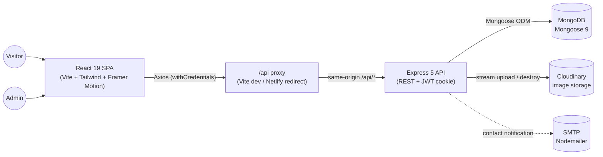

# Portfolio With Admin Panel — Step-by-Step Build Guide

> **Archived: original build playbook.** This document is the original roadmap used to build the Portfolio With Admin Panel project from an empty folder to a deployed MERN application. It is preserved as a "making-of" reference. The codebase may have evolved since this guide was written — for current setup, architecture, and deployment details, see [../README.md](../README.md).

---

> **Project Summary:** A full-stack MERN portfolio with a CMS-style admin panel. The public site renders a single-page portfolio (hero, about, skills, projects, contact) with a glassmorphism dark theme and Framer Motion animations. A single-admin role manages all content — projects (with Cloudinary image uploads, featured/draft status), skills (categorized, 0–100 proficiency), contact-form messages (inbox with read/unread state and SMTP email notifications), and dynamic site settings — from a JWT-protected admin panel. Authentication uses stateless JWTs delivered through secure `httpOnly` cookies. The Express API is security-hardened with Helmet, a strict CORS whitelist, tiered rate limiting, NoSQL-injection sanitization, bcrypt password hashing, input validation, and request size limits, and ships interactive Swagger/OpenAPI docs.

Each step below is a self-contained prompt. Execute them in order.

Stack: React 19, Vite 8, Tailwind CSS 4, Framer Motion 12, React Router 7, Axios · Node.js, Express 5, MongoDB (Mongoose 9), JWT (httpOnly cookies), Cloudinary, Nodemailer, Multer 2, bcryptjs, express-validator, Helmet, Swagger.

---

## Table of Contents

**PHASE 1 — Backend Foundation**

- STEP 1 — Project Scaffolding & Dependency Setup
- STEP 2 — Environment Config & Boot-Time Validation
- STEP 3 — Database Connection, User Model & Admin Seeder
- STEP 4 — Security Middleware & App Composition
- STEP 5 — Authentication with JWT httpOnly Cookies

**PHASE 2 — Backend Resources**

- STEP 6 — Project Resource & Cloudinary Image Uploads
- STEP 7 — Skill Resource
- STEP 8 — Contact Form, Messages Inbox & Email Notifications
- STEP 9 — Dynamic Site Settings Resource
- STEP 10 — Swagger / OpenAPI Documentation

**PHASE 3 — Client Foundation**

- STEP 11 — Client Scaffolding & Same-Origin API Proxy
- STEP 12 — Axios Instance & Service Layer
- STEP 13 — Auth & Settings Contexts
- STEP 14 — Routing, Layouts & Route Guards

**PHASE 4 — Client Pages**

- STEP 15 — Public Portfolio Sections
- STEP 16 — Admin Login & Dashboard
- STEP 17 — Admin Projects (Table, Form & Image Uploader)
- STEP 18 — Admin Skills, Messages & Settings

**PHASE 5 — Polish & Deploy**

- STEP 19 — SEO, Animations & UX Polish
- STEP 20 — Deployment (Render, Netlify & MongoDB Atlas)

**Appendices**

- Appendix A — Shared Constants & Conventions
- Appendix B — API Endpoint Reference
- Appendix C — Common Pitfalls
- Appendix D — Pre-Flight Checklist

---

## Global Build Rules (apply to EVERY step)

- **No git operations.** Do not run `git init`, `git add`, `git commit`, `git push`, or any other `git` command. Version control is handled manually by the user.
- **Do not install unapproved packages.** Only add the dependencies listed in a step. Prefer native methods and avoid unnecessary dependencies.
- **Do not run long-running processes** (dev servers, watchers, build pipelines) unless the step explicitly requires it.
- **Treat every step as self-contained.** Create or edit only the files named in the step.
- **Code style.** Modern ES6+, async/await, React Hooks. Function and variable names in English and `camelCase`. Keep code clean, readable, and DRY; make components and helpers reusable.
- **Security, performance, and accessibility are always priorities.** Validate and sanitize input, never expose secrets, use semantic HTML and accessible labels.
- **Secrets stay in `.env`.** Never hardcode credentials. Use placeholders in any committed example file.

---

## Architecture at a Glance

The system is a two-package monorepo: a React SPA (`client/`) and an Express REST API (`server/`). The client never talks to the API cross-origin — all requests go through a same-origin `/api` proxy so the `httpOnly` auth cookie is sent automatically.



The API layers requests as: `route → rate limiter → validators → validate → (protect → adminOnly) → controller → Mongoose model`, with a global error handler at the tail.

---

# PHASE 1 — BACKEND FOUNDATION

---

## STEP 1 — Project Scaffolding & Dependency Setup

**Goal:** Establish the monorepo layout and install backend dependencies.

**Create:**

```
portfolio-with-admin-panel/
├── client/          # React app (set up in Phase 3)
└── server/          # Express API
```

**In `server/`:**

- Initialize `package.json` with `"type": "commonjs"` and scripts:
  - `"dev": "nodemon index.js"`
  - `"start": "node index.js"`
  - `"seed": "node seed.js"`
- Install runtime dependencies: `express`, `mongoose`, `dotenv`, `cors`, `cookie-parser`, `helmet`, `express-rate-limit`, `express-mongo-sanitize`, `express-validator`, `jsonwebtoken`, `bcryptjs`, `multer`, `cloudinary`, `nodemailer`, `swagger-jsdoc`, `swagger-ui-express`.
- Install dev dependency: `nodemon`.

**Create folders:** `config/`, `controllers/`, `middlewares/`, `models/`, `routes/`, `utils/`, `validators/`.

**Acceptance:** `npm run dev` is wired (will fail until `index.js` exists). Folder skeleton is in place.

---

## STEP 2 — Environment Config & Boot-Time Validation

**Goal:** Centralize env parsing and fail fast on misconfiguration.

**Create `server/config/env.js`:**

- Load `dotenv`, then declare a `requiredVars` array: `MONGO_URI`, `JWT_SECRET`, `CLOUDINARY_CLOUD_NAME`, `CLOUDINARY_API_KEY`, `CLOUDINARY_API_SECRET`, `ADMIN_EMAIL`, `ADMIN_PASSWORD`, `SMTP_HOST`, `SMTP_USER`, `SMTP_PASS`, `CONTACT_TO_EMAIL`.
- Throw if any are missing.
- Export a typed `config` object (parse `PORT`/`SMTP_PORT` to ints, default `NODE_ENV=development`, `JWT_EXPIRES_IN=7d`, `CLIENT_URL=http://localhost:5173`).
- In production only, throw if `JWT_SECRET` < 32 chars, `ADMIN_PASSWORD` < 8 chars, or `CLIENT_URL` is `*`/contains `localhost`.

**Create `server/.env.example`** mirroring the variables (placeholders only).

**Acceptance:** Importing `config` with a complete `.env` returns parsed values; an incomplete `.env` throws a clear "Missing required environment variables" error at boot.

---

## STEP 3 — Database Connection, User Model & Admin Seeder

**Goal:** Connect to MongoDB and guarantee exactly one admin user exists.

**Create `server/models/User.js`:**

- Fields: `email` (unique, lowercase, trimmed), `password` (`select: false`), `role` (enum `["admin"]`, default `admin`). `timestamps: true`.
- `pre("save")` hook: hash password with bcrypt (12 salt rounds) only when modified.
- Instance method `comparePassword(candidate)` using `bcrypt.compare`.

**Create `server/seed.js`:**

- Export `seedAdmin()` that reads `adminEmail`/`adminPassword` from config. If no user, create one; if the password changed, update it; otherwise log "already exists".
- Add a standalone-run block (`require.main === module`) that connects, seeds, then disconnects — this powers `npm run seed`.

**Create `server/config/db.js`:**

- `connectDB()` connects via Mongoose, logs the host, then calls `seedAdmin()`. On failure, log and `process.exit(1)`.

**Acceptance:** `npm run seed` creates/updates the admin user idempotently.

---

## STEP 4 — Security Middleware & App Composition

**Goal:** Compose the Express app with a hardened middleware stack.

**Create `server/middlewares/rateLimiter.js`:** export four `express-rate-limit` limiters — `globalLimiter` (100/15min), `authLimiter` (10/15min), `contactLimiter` (5/hour in prod, 50 in dev), `uploadLimiter` (20/15min), all returning a JSON `{ success:false, message }`.

**Create `server/middlewares/errorHandler.js`:** a global error handler mapping Mongoose `CastError`/duplicate-key (`11000`)/`ValidationError` to `400`, defaulting to `err.statusCode || 500`. Include `stack` only in development.

**Create `server/index.js`:**

- `app.set("trust proxy", 1)` (for Render/proxies).
- `helmet(...)` with a CSP relaxed enough for Swagger UI and the welcome page (`scriptSrc`/`styleSrc` allow `'unsafe-inline'`, `imgSrc` allows `data:` and the swagger validator).
- `app.disable("x-powered-by")`.
- `cors({ origin: config.clientUrl, credentials: true })`.
- `cookieParser()`.
- `express.json({ limit: "10kb" })` and `urlencoded({ extended:true, limit:"10kb" })`.
- A small middleware that runs `mongoSanitize.sanitize()` on `req.body` and `req.params` (Express 5 makes `req.query` read-only, so do not reassign it).
- Mount `globalLimiter` on `/api`.
- Mount Swagger at `/api-docs` (Step 10), API routers (Phases below), a `/api/health` endpoint, and a styled HTML welcome page at `/`.
- Mount `errorHandler` last.
- `startServer()` awaits `connectDB()` then `app.listen(config.port)`.

**Acceptance:** `npm run dev` boots, connects to Mongo, seeds admin, and `GET /api/health` returns `{ success:true }`.

---

## STEP 5 — Authentication with JWT httpOnly Cookies

**Goal:** Single-admin login/logout/me using stateless JWTs stored in secure cookies.

**Create `server/utils/helpers.js`:**

- `generateToken(payload)` — `jwt.sign` with `config.jwtSecret` and `expiresIn`.
- `escapeHtml(str)` — escape `& < > " '` (used by the contact email).
- `parseDuration(str)` — convert `7d`/`12h`/`30m` to milliseconds (default 7d).
- `getCookieOptions(maxAge)` — `{ httpOnly:true, secure: prod, sameSite: prod ? "none" : "lax", maxAge }`.

**Create `server/middlewares/auth.js`:**

- `protect` — read the token from `req.cookies.token`, fall back to a `Bearer` header; verify it; load the user by id; attach `req.user`. Respond `401` on any failure.
- `adminOnly` — respond `403` unless `req.user.role === "admin"`.

**Create `server/validators/authValidator.js`:** `loginValidator` (valid email + non-empty password) using `express-validator`.

**Create `server/middlewares/validate.js`:** run `validationResult` and return `400` with a structured `errors` array, else `next()`.

**Create `server/controllers/authController.js`:**

- `login` — find user with `+password`, `comparePassword`, on success set the cookie via `getCookieOptions(parseDuration(jwtExpiresIn))` and return the safe user object.
- `logout` — `clearCookie("token", getCookieOptions(0))`.
- `getMe` — return `req.user` summary.

**Create `server/routes/authRoutes.js`:**

- `POST /login` → `authLimiter, loginValidator, validate, login`
- `POST /logout` → `protect, logout`
- `GET /me` → `protect, getMe`

Mount at `/api/auth` in `index.js`.

**Acceptance:** Logging in sets an `httpOnly` cookie; `GET /api/auth/me` works with the cookie; logout clears it.

---

# PHASE 2 — BACKEND RESOURCES

---

## STEP 6 — Project Resource & Cloudinary Image Uploads

**Goal:** Full CRUD for projects, with auto-slugging and Cloudinary images.

**Create `server/models/Project.js`:**

- Fields: `title` (required, ≤100), `slug` (unique, lowercase), `description` (required, ≤1000), `tech` (string array, at least one), `image` (`{ url, publicId }`), `liveUrl`/`githubUrl` (optional, URL-regex validated), `featured` (bool), `order` (number), `status` (enum `published|draft`, default `published`). `timestamps: true`.
- `pre("save")` hook: when `title` changes, generate a kebab-case slug; if it collides, append a base-36 timestamp.
- Indexes: `{ featured, order }` and `{ status }`.

**Create `server/utils/cloudinary.js`:** configure the Cloudinary SDK from `config`. Expose helpers to upload a memory buffer (e.g. via an upload stream into a `portfolio/projects` folder) and to destroy by `publicId`.

**Create `server/middlewares/uploadMiddleware.js`:**

- Multer with `memoryStorage`, a `fileFilter` allowing only `image/jpeg|jpg|png|webp`, and a `5MB` limit.
- Export `uploadSingle = upload.single("image")` and a `handleMulterError` middleware that converts Multer errors and the file-type error into clean `400` responses.

**Create `server/validators/projectValidator.js`:** `createProjectValidator` and `updateProjectValidator` (title, description, tech, optional URLs, status, featured, order).

**Create `server/controllers/projectController.js`:** `getAllProjects` (published only, sorted), `getProjectBySlug`, `getAdminProjects` (all), `createProject`, `updateProject`, `deleteProject` (also destroy the Cloudinary image), `uploadProjectImage` (replace existing image), `deleteProjectImage`.

**Create `server/routes/projectRoutes.js`:**

- `GET /` (public), `GET /admin/all` (admin — declare BEFORE `/:slug`), `GET /:slug` (public).
- `POST /`, `PUT /:id`, `DELETE /:id` (admin + validators).
- `POST /:id/image` (admin + `uploadLimiter, uploadSingle, handleMulterError`), `DELETE /:id/image` (admin).

Mount at `/api/projects`.

**Acceptance:** Admin can create/update/delete projects and upload/remove images; public endpoint returns only published projects.

---

## STEP 7 — Skill Resource

**Goal:** Categorized skills with proficiency levels.

**Create `server/models/Skill.js`:** `name` (unique, ≤50), `level` (0–100), `category` (enum `frontend|backend|database|devops|tools|other`), `order`. Index `{ category, order }`.

**Create `server/validators/skillValidator.js`:** create/update validators (name, level range, category enum).

**Create `server/controllers/skillController.js`:** `getAllSkills` (sorted by category/order), `createSkill`, `updateSkill`, `deleteSkill`.

**Create `server/routes/skillRoutes.js`:** `GET /` (public); `POST /`, `PUT /:id`, `DELETE /:id` (admin + validators). Mount at `/api/skills`.

**Acceptance:** Skills CRUD works; public list is grouped/sortable by category.

---

## STEP 8 — Contact Form, Messages Inbox & Email Notifications

**Goal:** Let visitors send messages; persist them and email the admin.

**Create `server/models/Message.js`:** `name` (≤100), `email` (lowercase), `message` (≤2000), `isRead` (default false). `timestamps: true`. Index `{ isRead, createdAt:-1 }`.

**Create `server/utils/sendEmail.js`:** a Nodemailer transporter built from SMTP config; export `sendEmail({ from, to, replyTo, subject, html })`.

**Create `server/validators/contactValidator.js`:** validate `name` (2–50), `email`, `message` (10–1000) with trim/escape.

**Create `server/controllers/contactController.js`:** `sendContactMessage` — escape fields with `escapeHtml`, build a responsive HTML email, `Message.create(...)`, then fire `sendEmail(...)` without blocking the response (catch and log delivery errors). Do not re-validate manually — the route already runs the validator.

**Create `server/controllers/messageController.js`:** `getMessages` (newest first), `markAsRead`, `deleteMessage`.

**Create routes:**

- `server/routes/contactRoutes.js` — `POST /` → `contactLimiter, contactValidator, validate, sendContactMessage`. Mount at `/api/contact`.
- `server/routes/messageRoutes.js` — `router.use(protect, adminOnly)` then `GET /`, `PATCH /:id/read`, `DELETE /:id`. Mount at `/api/messages`.

**Acceptance:** Submitting the contact form stores a message and sends an email; the admin inbox lists, marks-read, and deletes messages.

---

## STEP 9 — Dynamic Site Settings Resource

**Goal:** A single settings document the admin edits and the public site reads.

**Create `server/models/Settings.js`:** `name`, `role`, `greeting`, `tagline`, `location`, `email`, `profileImageUrl` (all default to empty string), `bio` (string array), `social` (`{ github, linkedin, twitter }`). `timestamps: true`.

> Keep string defaults empty (not placeholder text). The client merges only non-empty values over its `siteConfig` defaults, so empty fields cleanly fall back without fragile string comparisons.

**Create `server/controllers/settingsController.js`:** `getSettings` (find the singleton, create an empty one if none exists), `updateSettings` (whitelist allowed fields, upsert the singleton).

**Create `server/routes/settingsRoutes.js`:** `GET /` (public), `PUT /` (`protect, adminOnly`). Mount at `/api/settings`.

**Acceptance:** Public `GET /api/settings` returns the singleton; admin `PUT` persists changes.

---

## STEP 10 — Swagger / OpenAPI Documentation

**Goal:** Interactive API docs at `/api-docs`.

**Create `server/config/swagger.js`:** build an OpenAPI 3.0 spec with `swagger-jsdoc` — info/version (read from `package.json`), servers, security schemes (cookie + bearer), and reusable schema components for User, Project, Skill, Message, and Settings. Point `apis` at the route/controller files annotated with JSDoc `@swagger` comments.

**In `index.js`:** mount `swaggerUi.serve` + `swaggerUi.setup(swaggerSpec, { customCss, customSiteTitle })` at `/api-docs`.

**Acceptance:** `/api-docs` renders all endpoints with try-it-out.

---

# PHASE 3 — CLIENT FOUNDATION

---

## STEP 11 — Client Scaffolding & Same-Origin API Proxy

**Goal:** Set up the React + Vite + Tailwind app with a dev proxy.

**In `client/`:**

- Scaffold a Vite React app (`type: module`). Scripts: `dev`, `build`, `lint`, `preview`.
- Install runtime deps: `react`, `react-dom`, `react-router-dom`, `axios`, `framer-motion`, `react-helmet-async`, `react-hot-toast`, `react-icons`.
- Install dev deps: `vite`, `@vitejs/plugin-react`, `tailwindcss`, `@tailwindcss/vite`, `eslint` and the React ESLint plugins.

**Create `client/vite.config.js`:** register the `react()` and `tailwindcss()` plugins; set `server.port = 5173` and a proxy mapping `/api → http://localhost:5000` with `changeOrigin: true`.

**Create `client/src/index.css`:** import Tailwind and define the dark theme tokens (primary, dark scale) and base styles.

**Create `client/src/config/siteConfig.js`:** a central object of public defaults (name, role, greeting, tagline, location, email, social, SEO fields, bio, stats) plus derived helpers (`getFullTitle`, `getOgImageUrl`, `getInitials`).

> The client requires NO environment variables. All API calls are same-origin via the `/api` proxy, which keeps the auth cookie working without CORS headaches.

**Acceptance:** `npm run dev` serves the app at `5173` and proxies `/api` to the backend.

---

## STEP 12 — Axios Instance & Service Layer

**Goal:** One configured HTTP client and thin per-resource service wrappers.

**Create `client/src/api/axiosInstance.js`:**

- `axios.create({ baseURL: "/api", timeout: 30000, withCredentials: true })`.
- A response interceptor that retries idempotent `GET`s on `500/502/503/504`/timeout (max 3, linear backoff), redirects to `/admin/login` on `401` from a protected `/admin/*` route, and normalizes errors into `new Error(message)`.

**Create `client/src/services/*.js`:** `authService` (login/logout/getMe), `projectService`, `skillService`, `contactService`, `messageService`, `settingsService` — each a thin wrapper around `axiosInstance`.

**Acceptance:** Services compile and centralize all endpoint URLs; no component calls `axios` directly.

---

## STEP 13 — Auth & Settings Contexts

**Goal:** Global auth state and live site settings.

**Create `client/src/contexts/AuthContext.jsx`:**

- State: `user`, `loading`. `checkAuth()` calls `getMe()`; run it only on `/admin` routes. Re-check on an interval (e.g. 15 min) while authenticated.
- Expose `login`, `logout` (navigates to `/admin/login`), `isAdmin`. Memoize the context value. Provide a `useAuth()` hook that throws if used outside the provider.

**Create `client/src/contexts/SettingsContext.jsx`:**

- Fetch settings on mount. Compute a merged `settings` object: start from `siteConfig`, then override each scalar field ONLY if the API value is non-empty; merge non-empty social links; replace `bio` if the API array is non-empty.
- Derive `socialLinks` (label/href/icon) and `initials`. Provide a `useSettings()` hook.

**Acceptance:** `useAuth()` and `useSettings()` work; empty admin fields fall back to `siteConfig`.

---

## STEP 14 — Routing, Layouts & Route Guards

**Goal:** Wire public and protected routes with layouts.

**Create guards** in `client/src/guards/`:

- `AdminRoute.jsx` — while `loading`, render a spinner; if no admin user, redirect to `/admin/login`; else render `<Outlet />`.
- `GuestOnlyRoute.jsx` — redirect already-authenticated admins away from the login page.

**Create layouts** in `client/src/components/layout/`: `MainLayout` (public Navbar + Footer + `<Outlet />`), `AdminLayout` (admin sidebar with nav links and a live unread-message badge + `<Outlet />`).

**Create `client/src/App.jsx`:** wrap everything in `HelmetProvider` and define routes — public `MainLayout` (HomePage), `GuestOnlyRoute` (login), `AdminRoute` → `AdminLayout` (dashboard, projects, skills, messages, settings), and a `*` NotFound.

**Create `client/src/main.jsx`:** mount the app inside `BrowserRouter → SettingsProvider → AuthProvider`, and add a styled `<Toaster />`.

**Acceptance:** Visiting `/admin` without a session redirects to login; authenticated admins reach the dashboard.

---

# PHASE 4 — CLIENT PAGES

---

## STEP 15 — Public Portfolio Sections

**Goal:** Build the single-page portfolio.

**Create reusable UI** in `client/src/components/ui/`: `SectionWrapper`, `SectionHeading`, `GlassCard`, `GradientText`, `TechBadge`, `StatusBadge`, `SkillBar`, `ProjectCard`, `FeaturedProjectCard`, `ProfileAvatar`, `AnimatedCounter`, `ScrollProgressBar`, `ScrollToTop`, `Spinner`, `Skeleton`, `ConfirmModal`.

**Create `client/src/utils/animations.js`:** shared Framer Motion variants (fade/slide/stagger).

**Create sections** in `client/src/components/sections/`:

- `Hero` — greeting/name/role/tagline from `useSettings`, CTA buttons, social links, avatar.
- `About` — bio paragraphs + animated stat counters.
- `Skills` — fetch skills, group by category, render `SkillBar`s.
- `Projects` — fetch published projects, highlight featured, render cards with tech badges and live/GitHub links.
- `Contact` — controlled form posting to `contactService`, with toast feedback and disabled state while sending.

**Create `client/src/pages/HomePage.jsx`** composing the sections with `useScrollSpy` for active-nav highlighting, plus `client/src/pages/NotFoundPage.jsx`.

**Create hooks** in `client/src/hooks/`: `useDebounce`, `useMediaQuery`, `useScrollSpy`.

**Acceptance:** The public page renders all sections, animates on scroll, and the contact form sends messages.

---

## STEP 16 — Admin Login & Dashboard

**Goal:** Admin entry point and stats overview.

**Create `client/src/pages/AdminLoginPage.jsx`:** a controlled email/password form calling `login()`, redirecting to `/admin` on success, with toast errors and accessible labels.

**Create `client/src/pages/AdminDashboardPage.jsx`** + `client/src/components/admin/AdminStats.jsx`: fetch counts of projects, skills, and unread messages; render stat cards (animated counters), guarded with a `noindex` meta tag.

**Acceptance:** Admin can log in and see live content statistics.

---

## STEP 17 — Admin Projects (Table, Form & Image Uploader)

**Goal:** Manage projects from the panel.

**Create `client/src/pages/AdminProjectsPage.jsx`** orchestrating list/create/edit/delete state.

**Create `client/src/components/admin/ProjectTable.jsx`:** list all projects (admin endpoint) with status/featured badges and edit/delete actions (use `ConfirmModal` for delete).

**Create `client/src/components/admin/ProjectForm.jsx`:** create/edit form (title, description, tech list, live/GitHub URLs, featured, order, status).

**Create `client/src/components/admin/ImageUploader.jsx`:** upload to `POST /projects/:id/image` (multipart), show preview and a remove action; enforce image-only client-side as a courtesy.

**Acceptance:** Admin can create, edit, delete projects and upload/replace images.

---

## STEP 18 — Admin Skills, Messages & Settings

**Goal:** Remaining admin management screens.

**Create `client/src/pages/AdminSkillsPage.jsx`** + `client/src/components/admin/SkillForm.jsx` and `SkillTable.jsx`: CRUD skills (name, level slider, category select, order).

**Create `client/src/pages/AdminMessagesPage.jsx`:** inbox list with read/unread state; opening a message marks it read; delete via `ConfirmModal`. Surface the unread count to the sidebar badge.

**Create `client/src/pages/AdminSettingsPage.jsx`:** a form bound to `GET /settings`, saving via `PUT /settings`. Use `value || ""` with placeholders so empty fields show guidance text; split the bio textarea into paragraphs on save.

**Acceptance:** Skills, messages, and settings are fully manageable; settings changes reflect on the public site.

---

# PHASE 5 — POLISH & DEPLOY

---

## STEP 19 — SEO, Animations & UX Polish

**Goal:** Production-grade finish.

- **SEO:** use `react-helmet-async` to set per-page `<title>`, meta description, and Open Graph tags from `siteConfig`/settings. Add `noindex, nofollow` on all admin pages. Provide `client/public/robots.txt` and `client/public/sitemap.xml`.
- **Animations & micro-interactions:** apply the shared Framer Motion variants, the `ScrollProgressBar`, animated counters, and hover transitions.
- **Loading & feedback:** show `Skeleton`/`Spinner` while fetching; use `react-hot-toast` for every create/update/delete and error.
- **Accessibility:** semantic landmarks, labelled inputs, focus-visible styles, sufficient color contrast, keyboard-navigable controls.
- **Performance:** memoize context values and derived data, lazy-load below-the-fold work where it helps, keep images optimized via Cloudinary.

**Acceptance:** Lighthouse-friendly, accessible, animated UI with consistent toasts and loading states.

---

## STEP 20 — Deployment (Render, Netlify & MongoDB Atlas)

**Goal:** Ship the API and the SPA.

**MongoDB Atlas:** create a free cluster, a DB user with a strong password, allow `0.0.0.0/0` network access, and copy the `mongodb+srv://` URI.

**Backend — Render (Web Service):** Root Directory `server`, Build `npm install`, Start `npm start`, Environment `Node`. Add all env vars from Step 2 (set `NODE_ENV=production`, a 64-char `JWT_SECRET`, and `CLIENT_URL` = the Netlify URL with no trailing slash). Verify `GET /api/health`, then run `npm run seed` in the Render Shell.

**Frontend — Netlify:** Base Directory `client`, Build `npm run build`, Publish `dist`. Create `client/netlify.toml` with: a `/api/*` redirect (status 200, `force = true`) pointing at the Render backend URL (this keeps requests same-origin so the cookie is sent), and a `/*` SPA fallback to `/index.html`. No client env vars are needed.

**Post-deploy:** confirm `CLIENT_URL` on Render exactly matches the Netlify origin and redeploy the backend so CORS and the `sameSite=none; secure` cookie work end-to-end.

**Acceptance:** Public site loads from Netlify; admin login sets the cross-site cookie and all admin actions succeed against the Render API.

---

# Appendix A — Shared Constants & Conventions

- **Response shape:** every API response is `{ success: boolean, message?, data?|user?, errors? }`.
- **Auth transport:** JWT in an `httpOnly` cookie named `token`; `Bearer` header accepted as a fallback.
- **Rate-limit tiers:** global 100/15min · auth 10/15min · contact 5/hour (prod) · upload 20/15min.
- **Body limits:** JSON/urlencoded capped at `10kb`; uploads capped at `5MB`, images only (`jpeg/jpg/png/webp`).
- **Skill categories:** `frontend | backend | database | devops | tools | other`.
- **Project status:** `published | draft`; slugs are auto-generated and de-duplicated.
- **Naming:** English `camelCase` for identifiers; one route file and one controller per resource; services wrap all client API calls.

---

# Appendix B — API Endpoint Reference

| Method   | Endpoint                  | Auth      | Description               |
| -------- | ------------------------- | --------- | ------------------------- |
| `POST`   | `/api/auth/login`         | No        | Admin login (sets cookie) |
| `POST`   | `/api/auth/logout`        | JWT       | Admin logout              |
| `GET`    | `/api/auth/me`            | JWT       | Current user              |
| `GET`    | `/api/projects`           | No        | Published projects        |
| `GET`    | `/api/projects/admin/all` | JWT+Admin | All projects              |
| `GET`    | `/api/projects/:slug`     | No        | Project by slug           |
| `POST`   | `/api/projects`           | JWT+Admin | Create project            |
| `PUT`    | `/api/projects/:id`       | JWT+Admin | Update project            |
| `DELETE` | `/api/projects/:id`       | JWT+Admin | Delete project            |
| `POST`   | `/api/projects/:id/image` | JWT+Admin | Upload project image      |
| `DELETE` | `/api/projects/:id/image` | JWT+Admin | Delete project image      |
| `GET`    | `/api/skills`             | No        | All skills                |
| `POST`   | `/api/skills`             | JWT+Admin | Create skill              |
| `PUT`    | `/api/skills/:id`         | JWT+Admin | Update skill              |
| `DELETE` | `/api/skills/:id`         | JWT+Admin | Delete skill              |
| `POST`   | `/api/contact`            | No        | Send contact message      |
| `GET`    | `/api/messages`           | JWT+Admin | List messages             |
| `PATCH`  | `/api/messages/:id/read`  | JWT+Admin | Mark message read         |
| `DELETE` | `/api/messages/:id`       | JWT+Admin | Delete message            |
| `GET`    | `/api/settings`           | No        | Get site settings         |
| `PUT`    | `/api/settings`           | JWT+Admin | Update site settings      |
| `GET`    | `/api/health`             | No        | Health check              |
| `GET`    | `/api-docs`               | No        | Swagger UI                |

---

# Appendix C — Common Pitfalls

- **Route order:** declare `GET /projects/admin/all` BEFORE `GET /projects/:slug`, or `admin` is captured as a slug.
- **Express 5 + mongo-sanitize:** `req.query` is read-only — sanitize `req.body`/`req.params` in place; do not reassign `req.query`.
- **Cookie cross-site in prod:** the cookie needs `sameSite: "none"` + `secure: true`, and the frontend must call the API same-origin (Netlify `/api` redirect) or the browser will drop it.
- **CORS:** `origin` must be the exact `CLIENT_URL` with `credentials: true`; no wildcard when sending cookies.
- **Settings defaults:** keep DB string defaults empty so they never clobber a personalized `siteConfig` on the client.
- **Contact validation:** validate in the route (`contactValidator` + `validate`); don't duplicate the checks inside the controller.
- **Client env:** there is no `VITE_API_URL` — the client is env-free and relies on the `/api` proxy.

---

# Appendix D — Pre-Flight Checklist

- [ ] `server/.env` complete; server boots and seeds the admin user.
- [ ] `GET /api/health` returns `{ success: true }`.
- [ ] Login sets an `httpOnly` cookie; `/api/auth/me` works; logout clears it.
- [ ] Projects/skills/settings CRUD works; image upload + delete hit Cloudinary.
- [ ] Contact form stores a message and sends the notification email.
- [ ] Admin routes redirect to login when unauthenticated.
- [ ] `/api-docs` renders all endpoints.
- [ ] Netlify `/api/*` redirect points at the live Render URL; `CLIENT_URL` matches the Netlify origin.
- [ ] Public site reflects admin settings changes.
